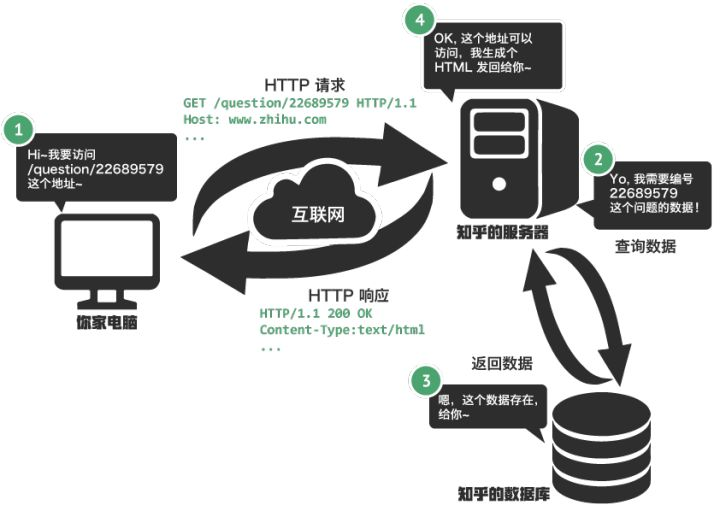

# 了解Web建站技术

## 网站访问流程

## 各项技术介绍

* HTML：一种标记语言，用于标记文本，指明文本是什么。
* CSS：用来为结构化文档添加样式的计算机语言。
* JavaScript与浏览器脚本：运行在浏览器的编程语言，可以动态修改网页的内容或样式。（注：JavaScript也可以在服务器端运行。例如使用Node.js作为服务器端的运行环境。）
* AJAX：全称为**Asynchronous JavaScript and XML**，是一套综合了多项技术的浏览器端网页开发技术。使用这套技术，我们可以在不刷新页面的情况下与服务器进行交互，并更新页面的一部分内容。
* Web Server：可以指服务器，也可以指服务器软件，用于提供Web Service。
* Web Service：协议加格式的交流体系。

## 参考

* Web 建站技术中，HTML、HTML5、XHTML、CSS、SQL、JavaScript、PHP、ASP.NET、Web Services 是什么？ - 张秋怡的回答 - 知乎 https://www.zhihu.com/question/22689579/answer/22318058

* 层叠样式表-维基百科 [https://zh.wikipedia.org/wiki/%E5%B1%82%E5%8F%A0%E6%A0%B7%E5%BC%8F%E8%A1%A8](https://zh.wikipedia.org/wiki/层叠样式表)

* AJAX-维基百科 https://zh.wikipedia.org/wiki/AJAX